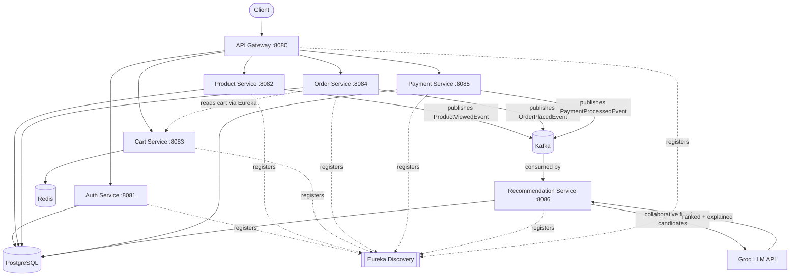

# 🛒 Cloud-Native Ecommerce Platform


## 📖 Project Overview

A production-style ecommerce backend built as eight independent Spring Boot
microservices, with event-driven communication via Kafka and an AI-powered
recommendation engine using collaborative filtering + LLM re-ranking.

Built from scratch as a placement portfolio project — every service was
designed, coded, debugged, and tested end to end.

## ✨ Features

- **JWT authentication** — register/login with BCrypt password hashing
- **Product catalog** — full CRUD, pagination, category filtering, search
- **Redis-backed shopping cart** — fast add/remove/update, no relational overhead
- **Order processing** — reads the cart via service-to-service calls, persists
  the order, publishes events
- **Mock payment gateway** — simulates realistic success/failure rates per
  payment method (card, UPI, COD)
- **AI-powered recommendations** — Kafka-driven collaborative filtering,
  re-ranked and explained by an LLM (Groq / Llama 3.1)
- **Service discovery** — every service registers with Eureka; no hardcoded
  hosts or ports anywhere
- **Single entry point** — Spring Cloud Gateway routes all external traffic

## 🏗 Architecture



## 🛠 Technology Stack

| Layer | Technology |
|---|---|
| Language / runtime | Java 21, Spring Boot 3.3.4, Spring Cloud 2023.0.3 |
| Service discovery | Netflix Eureka |
| API gateway | Spring Cloud Gateway |
| Messaging | Apache Kafka |
| Databases | PostgreSQL (Auth, Product, Order, Payment, Recommendation), Redis (Cart) |
| Auth | JWT (jjwt), Spring Security, BCrypt |
| AI | Groq API (Llama 3.1 8B) for recommendation re-ranking |
| Containerization | Docker, Docker Compose |
| Build | Maven (multi-module) |

## 📂 Folder Structure

```
ecommerce-platform/
├── eureka-server/           # Service discovery
├── api-gateway/             # Single entry point, routes to all services
├── auth-service/            # JWT register/login
├── product-service/         # Catalog CRUD, publishes view events
├── cart-service/            # Redis-backed cart
├── order-service/           # Places orders, publishes order events
├── payment-service/         # Mock payment gateway
├── recommendation-service/  # Collaborative filtering + LLM re-ranking
├── docker/                  # Postgres multi-db init script
├── docker-compose.yml       # Postgres, Redis, Kafka, Zookeeper
└── pom.xml                  # Parent Maven module
```

Each service follows the same internal layout:
`controller → service → repository → entity`, with `dto`, `exception`, and
`config` packages as needed.

## 🔄 Request Flow

Example: a client fetching a single product.

```
Client
  │  GET /api/products/1
  ▼
API Gateway (8080)
  │  looks up "product-service" via Eureka, forwards the request
  ▼
Eureka Discovery
  │  resolves the current healthy instance of product-service
  ▼
Product Service (8082)
  │  queries the product by id
  ▼
PostgreSQL
  │  returns the row
  ▼
Product Service
  │  also publishes a ProductViewedEvent to Kafka before responding
  ▼
Response → Client
```

Every request in this system follows the same shape: the gateway never talks
directly to a hardcoded host — it always resolves the target service through
Eureka first, which is what lets services scale, restart, or move without
breaking the routing.

## ⚡ Kafka Event Flow

Kafka decouples the services that create data from the service that
consumes it for recommendations — product-service and order-service don't
know recommendation-service exists, and vice versa.

```
Product viewed  (product-service)
  ↓  publishes ProductViewedEvent → topic: product-events
Order placed    (order-service)
  ↓  publishes OrderPlacedEvent   → topic: order-events
Payment processed (payment-service)
  ↓  publishes PaymentProcessedEvent → topic: payment-events
                    ↓
         recommendation-service consumes both
         product-events and order-events
                    ↓
     Each event is stored as a weighted UserInteraction
     (VIEW = weak signal, PURCHASE = strong signal)
                    ↓
        Collaborative filtering runs against this
        interaction history on the next recommendation request
                    ↓
              Groq AI re-ranks and explains
                    ↓
              Final recommendation response
```

Each topic is partitioned by user/entity id, so events for the same user
stay in order. Consumer groups are scoped per-service
(`recommendation-service-product-events`,
`recommendation-service-order-events`), so adding more consumers later
doesn't require touching the producers at all.

## 🤖 AI Recommendation Flow

```
User views/purchases a product
              ↓
   Interaction stored (Kafka → Postgres)
              ↓
   Collaborative filtering finds candidates
   (users with overlapping history →
    what they liked that this user hasn't)
              ↓
   Candidate IDs enriched with real product
   details via a call to product-service
              ↓
   Candidates + user's recent history sent
   to Groq's Llama 3.1 model
              ↓
   Model picks the best matches and writes
   a short explanation for each
              ↓
   Re-ranked, explained recommendations
   returned via the API
```

If the LLM call fails or isn't configured, the system **falls back
gracefully** to the plain collaborative-filtering order with a generic
reason — the feature degrades, it never breaks the request.

## 📸 Screenshots

**All 7 services registered with Eureka**


**Docker infrastructure + project structure**


**Product service**


**AI-powered recommendation — real Groq-generated explanations**


## 🚀 Installation Guide

**Prerequisites:** Java 21, Maven, Docker Desktop, an IDE (IntelliJ recommended)

1. **Start infrastructure**
   ```bash
   docker compose up -d
   ```

2. **Set required environment variables**

   | Variable | Purpose | Where to get it |
   |---|---|---|
   | `GROQ_API_KEY` | Powers the LLM recommendation re-ranking | Free, no card required — [console.groq.com](https://console.groq.com) |

3. **Configure your database connection**

   Each service's `application.yml` expects a local PostgreSQL database.
   Update the `datasource` block in each service to match your local
   Postgres username/password, or export them as environment variables.

4. **Run the services, in this order** (each has its own `main` class —
   run from your IDE or `mvn spring-boot:run` inside each module):
   1. `eureka-server`
   2. `api-gateway`
   3. `auth-service`
   4. `product-service`
   5. `cart-service`
   6. `order-service`
   7. `payment-service`
   8. `recommendation-service`

5. **Verify it's up:** open `http://localhost:8761` — you should see all
   seven services registered.

## 🐳 Docker Setup

`docker-compose.yml` at the project root brings up the four pieces of
infrastructure the Spring Boot services depend on — it does **not** run the
Spring Boot services themselves (they run from your IDE for now; see
[Future Improvements](#-future-improvements)).

| Container | Image | Port | Purpose |
|---|---|---|---|
| `ecommerce-postgres` | postgres:16 | 5432 | Auth, Product, Order, Payment, Recommendation data |
| `ecommerce-redis` | redis:7-alpine | 6379 | Cart storage |
| `ecommerce-zookeeper` | confluentinc/cp-zookeeper:7.6.0 | 2181 | Kafka coordination |
| `ecommerce-kafka` | confluentinc/cp-kafka:7.6.0 | 9092 | Event bus |

```bash
docker compose up -d      # start everything
docker ps                 # confirm all 4 are "Up"
docker compose down       # stop and remove containers (data volume persists)
```

## 📡 API Endpoints

All requests go through the gateway at `http://localhost:8080`.

**Auth**
```
POST /api/auth/register
POST /api/auth/login
```

**Product**
```
GET    /api/products              # paginated, ?category= or ?search=
GET    /api/products/{id}         # also fires a "viewed" event
POST   /api/products
PUT    /api/products/{id}
DELETE /api/products/{id}
```

**Cart**
```
POST   /api/cart/{userId}/add
GET    /api/cart/{userId}
DELETE /api/cart/{userId}/remove/{productId}
DELETE /api/cart/{userId}/clear
```

**Order**
```
POST /api/orders/{userId}/place
GET  /api/orders/{orderId}
GET  /api/orders/user/{userId}
```

**Payment**
```
POST /api/payments/process
GET  /api/payments/order/{orderId}
```

**Recommendations**
```
GET /api/recommendations/{userId}?limit=5
```

## 📈 Future Improvements

- [ ] Docker Compose file to run all Spring Boot services (not just infra)
- [ ] Swagger/OpenAPI docs, kept in sync with the code automatically
- [ ] Unit and integration tests (JUnit, Mockito)
- [ ] Global exception handling audit across all services
- [ ] AWS deployment (EC2, RDS, S3 for product images)
- [ ] CI/CD via GitHub Actions
- [ ] Redis caching for product/category reads
- [ ] Role-based access control (ADMIN / SELLER / CUSTOMER)
- [ ] Centralized logging and monitoring (Prometheus, Grafana)
- [ ] Kubernetes deployment
- [ ] Elasticsearch-powered product search
- [ ] Notification service
- [ ] Real payment gateway integration (Stripe/Razorpay)
- [ ] Inventory service
- [ ] Distributed tracing (e.g. Zipkin/Jaeger)

## 🔒 Security Note

Local development credentials in `application.yml` files are placeholders
for local-only Postgres/Redis instances. Do not reuse these passwords
anywhere else. The Groq API key is loaded from an environment variable and
is never committed to the repository.
