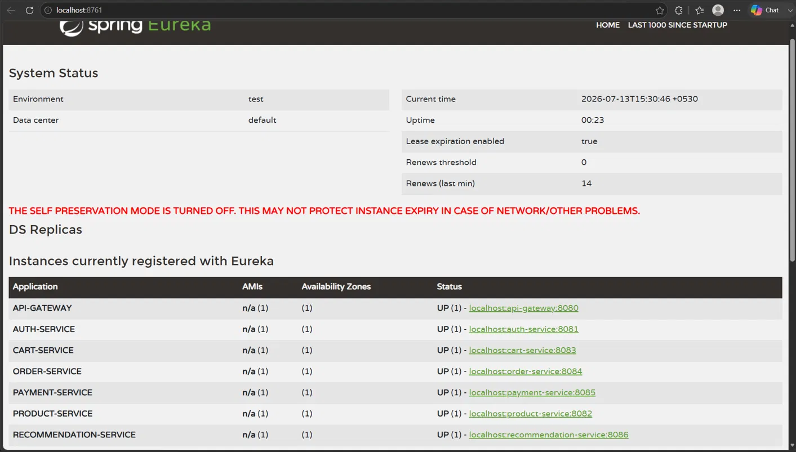
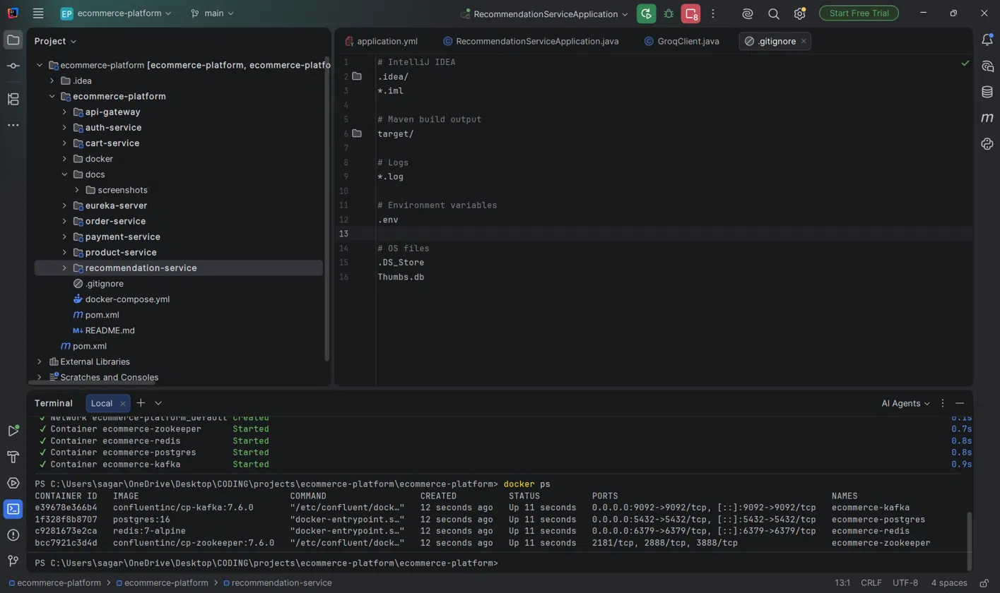
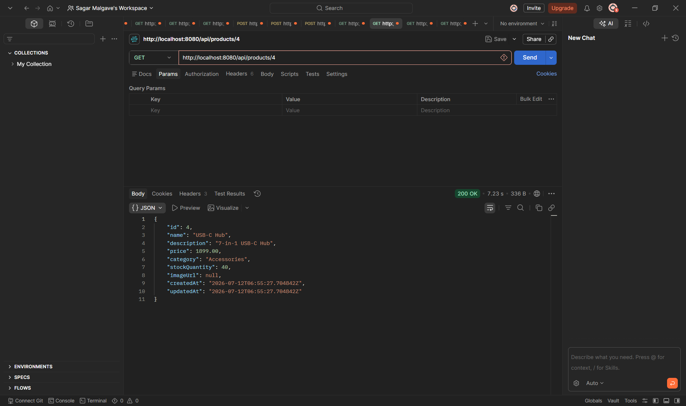
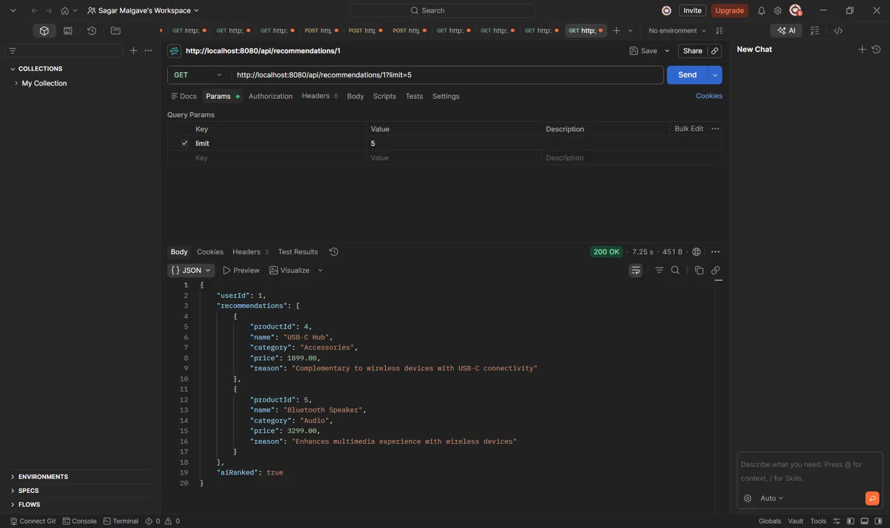

# Cloud-Native Ecommerce Platform

A production-style ecommerce backend built as eight independent Spring Boot
microservices, with event-driven communication via Kafka and an AI-powered
recommendation engine using collaborative filtering + LLM re-ranking.

Built from scratch as a placement portfolio project — every service was
designed, coded, debugged, and tested end to end.

## Features

- **JWT authentication** — register/login with BCrypt password hashing
- **Product catalog** — full CRUD, pagination, category filtering, search
- **Redis-backed shopping cart** — fast add/remove/update, no relational overhead
- **Order processing** — reads the cart via service-to-service calls, persists
  the order, publishes events
- **Mock payment gateway** — simulates realistic success/failure rates per
  payment method (card, UPI, COD)
- **AI-powered recommendations** — Kafka-driven collaborative filtering,
  re-ranked and explained by an LLM (Groq / Llama 3.1)
- **Service discovery** — every service registers with Eureka; no hardcoded
  hosts or ports anywhere
- **Single entry point** — Spring Cloud Gateway routes all external traffic

## Tech stack

| Layer | Technology |
|---|---|
| Language / runtime | Java 21, Spring Boot 3.3.4, Spring Cloud 2023.0.3 |
| Service discovery | Netflix Eureka |
| API gateway | Spring Cloud Gateway |
| Messaging | Apache Kafka |
| Databases | PostgreSQL (Auth, Product, Order, Payment, Recommendation), Redis (Cart) |
| Auth | JWT (jjwt), Spring Security, BCrypt |
| AI | Groq API (Llama 3.1 8B) for recommendation re-ranking |
| Containerization | Docker, Docker Compose |
| Build | Maven (multi-module) |

## Architecture


## Folder structure

```
ecommerce-platform/
├── eureka-server/           # Service discovery
├── api-gateway/             # Single entry point, routes to all services
├── auth-service/            # JWT register/login
├── product-service/         # Catalog CRUD, publishes view events
├── cart-service/             # Redis-backed cart
├── order-service/           # Places orders, publishes order events
├── payment-service/          # Mock payment gateway
├── recommendation-service/   # Collaborative filtering + LLM re-ranking
├── docker/                   # Postgres multi-db init script
├── docker-compose.yml        # Postgres, Redis, Kafka, Zookeeper
└── pom.xml                   # Parent Maven module
```

Each service follows the same internal layout:
`controller → service → repository → entity`, with `dto`, `exception`, and
`config` packages as needed.

## How to run locally

**Prerequisites:** Java 21, Maven, Docker Desktop, an IDE (IntelliJ recommended)

1. **Start infrastructure**
   ```bash
   docker compose up -d
   ```
   This brings up PostgreSQL, Redis, Kafka, and Zookeeper.

2. **Set required environment variables**

   | Variable | Purpose | Where to get it |
   |---|---|---|
   | `GROQ_API_KEY` | Powers the LLM recommendation re-ranking | Free, no card required — [console.groq.com](https://console.groq.com) |

3. **Configure your database connection**

   Each service's `application.yml` expects a local PostgreSQL database.
   Update the `datasource` block in each service to match your local
   Postgres username/password, or export them as environment variables.

4. **Run the services, in this order** (each has its own `main` class —
   run from your IDE or `mvn spring-boot:run` inside each module):
   1. `eureka-server`
   2. `api-gateway`
   3. `auth-service`
   4. `product-service`
   5. `cart-service`
   6. `order-service`
   7. `payment-service`
   8. `recommendation-service`

5. **Verify it's up:** open `http://localhost:8761` — you should see all
   seven services registered.

## API endpoints

All requests go through the gateway at `http://localhost:8080`.

**Auth**
```
POST /api/auth/register
POST /api/auth/login
```

**Product**
```
GET    /api/products              # paginated, ?category= or ?search=
GET    /api/products/{id}         # also fires a "viewed" event
POST   /api/products
PUT    /api/products/{id}
DELETE /api/products/{id}
```

**Cart**
```
POST   /api/cart/{userId}/add
GET    /api/cart/{userId}
DELETE /api/cart/{userId}/remove/{productId}
DELETE /api/cart/{userId}/clear
```

**Order**
```
POST /api/orders/{userId}/place
GET  /api/orders/{orderId}
GET  /api/orders/user/{userId}
```

**Payment**
```
POST /api/payments/process
GET  /api/payments/order/{orderId}
```

**Recommendations**
```
GET /api/recommendations/{userId}?limit=5
```

## AI recommendation flow

1. Every product view and completed order publishes a Kafka event
2. `recommendation-service` consumes both topics and records each as a
   weighted signal (`VIEW` or `PURCHASE`) per user
3. **Collaborative filtering** (plain SQL/Java, no AI): finds users with
   overlapping interaction history, surfaces what they engaged with that
   the current user hasn't — classic "people who bought X also bought Y"
4. The candidate product IDs are enriched with real product details via a
   service-to-service call to `product-service`
5. The candidates + the user's recent history are sent to **Groq's Llama
   3.1** model, which picks the best matches and writes a short explanation
   for each
6. If the LLM call fails or isn't configured, the system **falls back
   gracefully** to the plain collaborative-filtering order with a generic
   reason — the feature degrades, it never breaks

## Screenshots

**All 7 services registered with Eureka**


**Docker infrastructure + project structure**


**Product service**


**AI-powered recommendation — real Groq-generated explanations**

## Future improvements

- [ ] Docker Compose file to run all Spring Boot services (not just infra)
- [ ] Unit and integration tests (JUnit, Mockito)
- [ ] Global exception handling audit across all services
- [ ] AWS deployment (EC2, RDS, S3 for product images)
- [ ] CI/CD via GitHub Actions
- [ ] Redis caching for product/category reads
- [ ] Role-based access control (ADMIN / SELLER / CUSTOMER)
- [ ] Centralized logging and monitoring (Prometheus, Grafana)

## Security note

Local development credentials in `application.yml` files are placeholders
for local-only Postgres/Redis instances. Do not reuse these passwords
anywhere else. The Groq API key is loaded from an environment variable and
is never committed to the repository.
